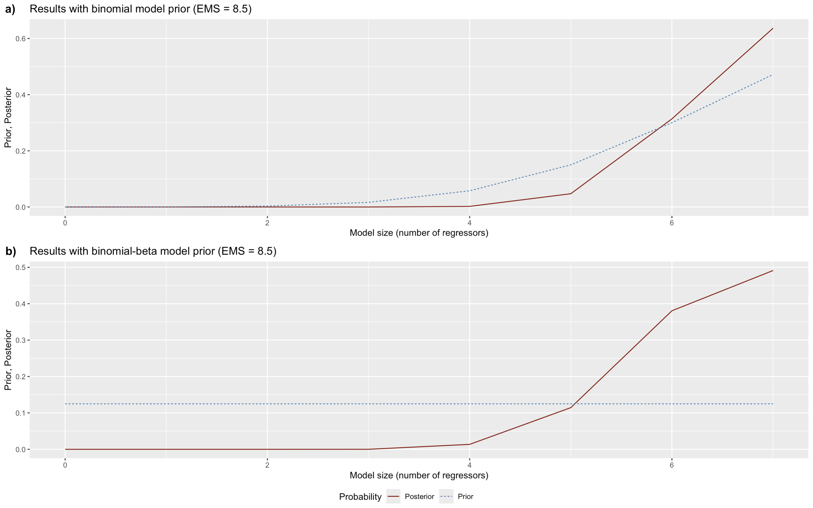
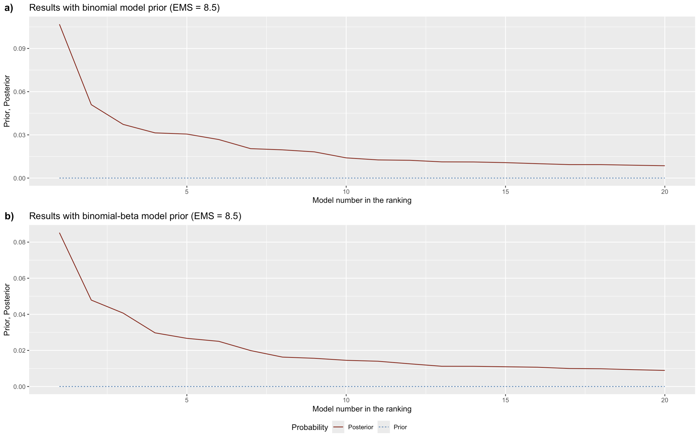
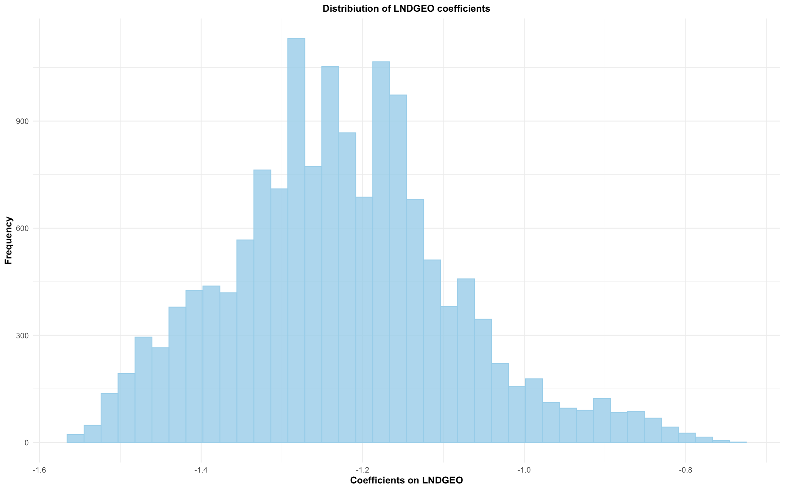
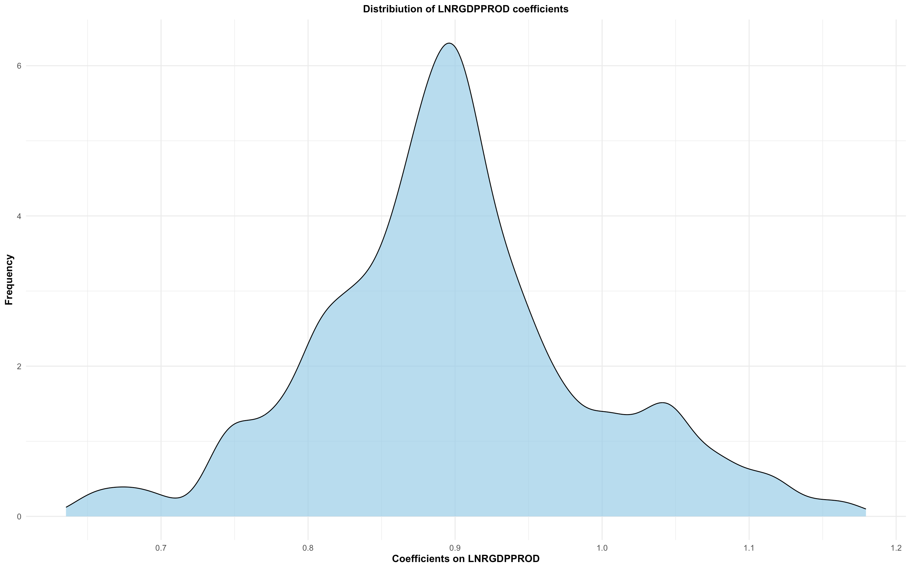
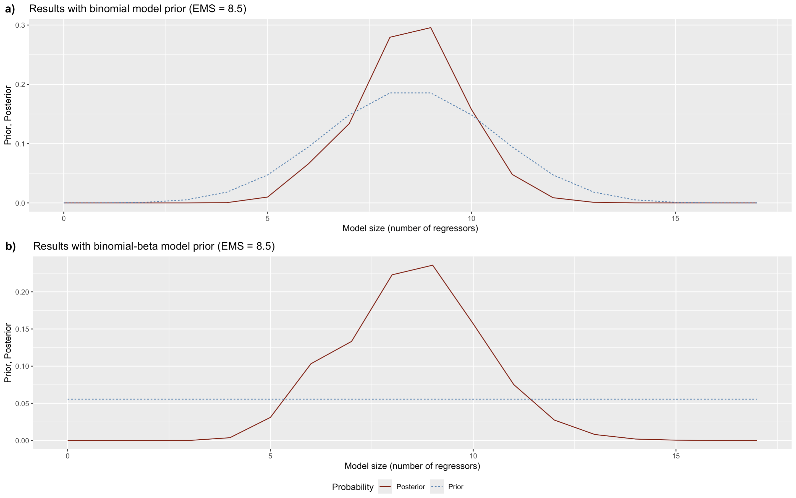
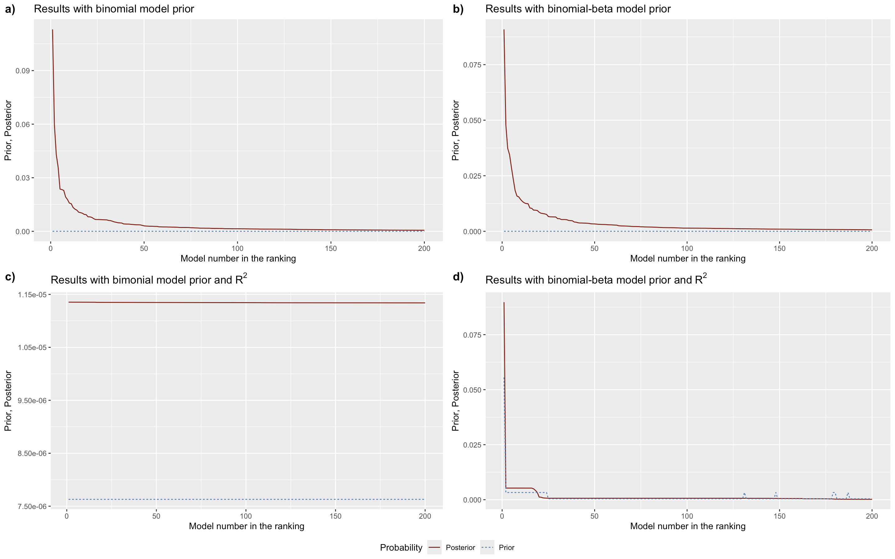
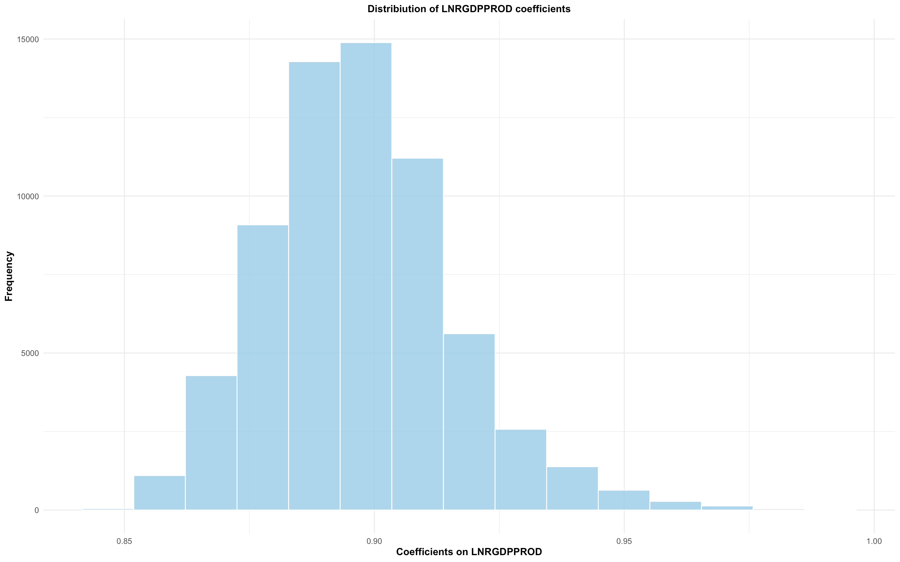
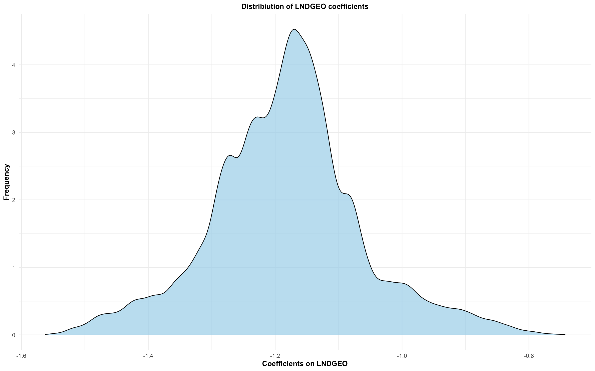

---
output:
  github_document:
    html_preview: false
---

<!-- README.md is generated from README.Rmd. Please edit that file -->

```{r, include = FALSE}
knitr::opts_chunk$set(
  collapse = TRUE,
  comment = "#>",
  fig.path = "man/figures/README-",
  out.width = "100%"
)
```

# rmsBMA

<!-- badges: start -->
<!-- badges: end -->

Bayesian Model Averaging (BMA) for settings with a high number of regressors and a limited number of observations. The package provides standard BMA tools, including the estimation of BMA statistics, Extreme Bounds Analysis, Bayesian model selection, and jointness analysis. It also offers graphical functions for exploring the model space and coefficient distributions. Moreover, it introduces a non-empirical dilution prior to address multicollinearity in the presence of model uncertainty. When the model space is too large to enumerate, it can be explored by MC^3 sampling instead.

## Installation

You can install the released version of rmsBMA from [CRAN](https://CRAN.R-project.org) with:

``` r
install.packages("rmsBMA")
```

You can install the development version of rmsBMA from [GitHub](https://github.com/) with:

``` r
# install.packages("pak")
pak::pak("becku182/rmsBMA")
```

## Example 1

Example of finding robust determinants of the dependent variable in the context of linear regression using Bayesian model averaging with reduced model space. The example uses data on the determinants of international trade for 25 European Union countries.

```r
# loading the package
library(rmsBMA)

# inspecting the trade data set

round(head(Trade_data)[,1:16],2)

 LNTRADE B LNDGEO L LNRGDPPROD RGDPpcDIFF  GOV HUMAN       CPW INFVAR ARABLE ARABLEpw  LAND LANDpc   EPCpc   FDI
   22.45 0   7.01 1      25.16       0.09 0.03  0.23   9955.85   0.19  11.01     2.15 52292   7154  587.15 13.74
   20.68 0   6.92 0      23.76       1.21 0.14  0.07 189220.51   2.10  13.28     4.10 26375   4016 3632.99  8.97
   18.37 0   7.61 0      22.18       0.44 0.02  0.09  19423.21   0.40   5.89    32.91 73332   2265 3797.95  5.49
   22.93 1   5.68 0      24.74       0.50 0.11  0.63  89762.36   0.71  24.81     4.04  5318   2560 1668.44  3.49
   21.20 0   7.00 0      24.62       0.02 0.06  0.12  24264.09   0.24  38.74    15.43 40142   2248 1309.72  4.12
   18.93 0   7.42 0      22.41       0.83 0.12  0.47 150494.26   1.61   2.53    20.01 40182  21311 2288.56  5.86

# First we build model space using model space function. At this point we need to choose maximum model size (M) 
# and g prior. We start with M = 7 considering only models with 7 or less regressors and Unit Informatio Piror. 

modelSpace <- model_space(Trade_data, M = 7, g = "UIP")

# Using the modelSpace object, BMA statistics can be computed under the selected model prior specifications.

bma_list <- bma(modelSpace, round = 3)

# Now we can see the results obtained using uniform model prior.

bma_list[[1]]

             PIP     PM   PSD  PMcon PSDcon  P(+)   PSC
CONST         NA  8.093 0.759  8.093  0.759 1.000 1.000
B          0.817  0.347 0.208  0.424  0.142 0.816 0.907
LNDGEO     1.000 -1.175 0.081 -1.175  0.081 0.000 1.000
L          0.185  0.063 0.161  0.343  0.210 0.175 0.583
LNRGDPPROD 1.000  0.887 0.021  0.887  0.021 1.000 1.000
RGDPpcDIFF 0.074 -0.007 0.064 -0.094  0.220 0.026 0.511
GOV        0.984 -4.011 1.197 -4.074  1.093 0.000 0.992
HUMAN      0.056 -0.004 0.050 -0.068  0.199 0.021 0.508
CPW        0.147  0.000 0.000  0.000  0.000 0.136 0.562
INFVAR     0.931 -0.038 0.015 -0.040  0.012 0.000 0.965
ARABLE     0.210  0.001 0.003  0.006  0.003 0.202 0.597
ARABLEpw   0.702 -0.006 0.005 -0.009  0.003 0.003 0.847
LAND       0.060  0.000 0.000  0.000  0.000 0.035 0.505
LANDpc     0.749  0.000 0.000  0.000  0.000 0.747 0.872
EPCpc      0.290  0.000 0.000  0.000  0.000 0.279 0.634
FDI        0.829  0.023 0.014  0.028  0.010 0.827 0.913
KSI        0.401 -0.414 0.590 -1.033  0.479 0.006 0.694
BCIDIFF    0.062  0.000 0.001  0.000  0.003 0.024 0.507

# We can compare them with the results obtained using binomial-beta model prior.

bma_list[[2]]

             PIP     PM   PSD  PMcon PSDcon  P(+)   PSC
CONST         NA  8.106 0.760  8.106  0.760 1.000 1.000
B          0.797  0.338 0.212  0.424  0.142 0.795 0.897
LNDGEO     1.000 -1.178 0.083 -1.178  0.083 0.000 1.000
L          0.201  0.068 0.165  0.338  0.210 0.190 0.589
LNRGDPPROD 1.000  0.887 0.021  0.887  0.021 1.000 1.000
RGDPpcDIFF 0.083 -0.007 0.068 -0.087  0.220 0.030 0.512
GOV        0.984 -4.021 1.201 -4.085  1.098 0.000 0.992
HUMAN      0.066 -0.005 0.054 -0.071  0.199 0.024 0.509
CPW        0.167  0.000 0.000  0.000  0.000 0.155 0.572
INFVAR     0.934 -0.038 0.015 -0.041  0.012 0.000 0.967
ARABLE     0.232  0.001 0.003  0.006  0.003 0.223 0.607
ARABLEpw   0.663 -0.006 0.005 -0.009  0.003 0.003 0.828
LAND       0.070  0.000 0.000  0.000  0.000 0.042 0.507
LANDpc     0.745  0.000 0.000  0.000  0.000 0.742 0.869
EPCpc      0.298  0.000 0.000  0.000  0.000 0.286 0.637
FDI        0.782  0.022 0.015  0.028  0.010 0.780 0.889
KSI        0.398 -0.407 0.584 -1.020  0.480 0.007 0.693
BCIDIFF    0.072  0.000 0.001  0.000  0.003 0.028 0.508

# We might compare those results with the one obtained using Extreme Bounds Analysis.

bma_list[[3]]

   Variable Lower bound Minimum   Mean Maximum Upper bound EBA test    %(+)
      CONST      -4.966  -3.240 15.249  33.075      35.147     FAIL  87.098
          B      -0.073   0.235  1.217   2.720       3.440     FAIL 100.000
     LNDGEO      -1.874  -1.563 -1.182  -0.743      -0.357     PASS   0.000
          L      -0.990   0.066  1.039   3.275       4.374     FAIL 100.000
 LNRGDPPROD       0.792   0.844  0.894   0.992       1.062     PASS 100.000
 RGDPpcDIFF      -4.621  -3.605 -0.707   0.586       1.488     FAIL  11.766
        GOV     -26.535 -20.032 -6.657   0.223       3.948     FAIL   0.029
      HUMAN      -2.368  -1.133 -0.208   0.885       1.996     FAIL  18.137
        CPW       0.000   0.000  0.000   0.000       0.000     FAIL  71.011
     INFVAR      -0.225  -0.158 -0.045   0.033       0.105     FAIL   3.571
     ARABLE      -0.050  -0.030 -0.003   0.015       0.025     FAIL  50.570
   ARABLEpw      -0.093  -0.076 -0.027   0.014       0.022     FAIL  11.230
       LAND       0.000   0.000  0.000   0.000       0.000     FAIL  60.468
     LANDpc       0.000   0.000  0.000   0.000       0.000     FAIL  31.876
      EPCpc       0.000   0.000  0.000   0.000       0.000     FAIL  81.988
        FDI      -0.159  -0.120  0.023   0.134       0.180     FAIL  76.193
        KSI     -11.977  -9.997 -3.459   0.358       2.608     FAIL   0.105
    BCIDIFF      -0.062  -0.037  0.013   0.061       0.085     FAIL  69.551

# Using bma_list objest we can calculate jointness measures for the regressors.

jointness(bma_list)[1:10,1:10]

                B LNDGEO      L LNRGDPPROD RGDPpcDIFF    GOV  HUMAN    CPW INFVAR ARABLE
B              NA  0.635 -0.561      0.635     -0.529  0.622 -0.545 -0.363  0.556 -0.275
LNDGEO      0.593     NA -0.631      1.000     -0.853  0.969 -0.888 -0.705  0.861 -0.580
L          -0.487 -0.599     NA     -0.631      0.520 -0.613  0.543  0.409 -0.507  0.331
LNRGDPPROD  0.593  1.000 -0.599         NA     -0.853  0.969 -0.888 -0.705  0.861 -0.580
RGDPpcDIFF -0.461 -0.833  0.491     -0.833         NA -0.855  0.747  0.588 -0.747  0.470
GOV         0.584  0.969 -0.581      0.969     -0.835     NA -0.857 -0.673  0.847 -0.549
HUMAN      -0.478 -0.869  0.513     -0.869      0.719 -0.838     NA  0.609 -0.753  0.498
CPW        -0.270 -0.665  0.389     -0.665      0.561 -0.632  0.577     NA -0.561  0.451
INFVAR      0.533  0.868 -0.479      0.868     -0.732  0.856 -0.739 -0.526     NA -0.458
ARABLE     -0.174 -0.537  0.328     -0.537      0.451 -0.506  0.475  0.466 -0.417     NA

# Next we can examine which models are the best according to PMP calculated 
# using unform model prior.

Best <- best_models(bma_list, best = 5, round = 3)

# We can look at which variables are present in the best models 
# (PMPs and R^2 are in the two last rows).

Best[[3]]

#> |           | 'No. 1' | 'No. 2' | 'No. 3' | 'No. 4' | 'No. 5' |
#> |:----------|:-------:|:-------:|:-------:|:-------:|:-------:|
#> |Const      |  1.000  |  1.000  |  1.000  |  1.000  |  1.000  |
#> |B          |  1.000  |  1.000  |  1.000  |  1.000  |  1.000  |
#> |LNDGEO     |  1.000  |  1.000  |  1.000  |  1.000  |  1.000  |
#> |L          |  0.000  |  0.000  |  0.000  |  0.000  |  0.000  |
#> |LNRGDPPROD |  1.000  |  1.000  |  1.000  |  1.000  |  1.000  |
#> |RGDPpcDIFF |  0.000  |  0.000  |  0.000  |  0.000  |  0.000  |
#> |GOV        |  1.000  |  1.000  |  1.000  |  1.000  |  1.000  |
#> |HUMAN      |  0.000  |  0.000  |  0.000  |  0.000  |  0.000  |
#> |CPW        |  0.000  |  0.000  |  0.000  |  0.000  |  0.000  |
#> |INFVAR     |  1.000  |  1.000  |  1.000  |  1.000  |  1.000  |
#> |ARABLE     |  0.000  |  0.000  |  0.000  |  1.000  |  0.000  |
#> |ARABLEpw   |  1.000  |  1.000  |  1.000  |  1.000  |  0.000  |
#> |LAND       |  0.000  |  0.000  |  0.000  |  0.000  |  0.000  |
#> |LANDpc     |  1.000  |  1.000  |  0.000  |  1.000  |  1.000  |
#> |EPCpc      |  0.000  |  0.000  |  1.000  |  0.000  |  0.000  |
#> |FDI        |  1.000  |  1.000  |  1.000  |  1.000  |  0.000  |
#> |KSI        |  0.000  |  1.000  |  1.000  |  0.000  |  0.000  |
#> |BCIDIFF    |  0.000  |  0.000  |  0.000  |  0.000  |  0.000  |
#> |PMP        |  0.107  |  0.051  |  0.037  |  0.031  |  0.031  |
#> |R^2        |  0.927  |  0.928  |  0.927  |  0.927  |  0.923  |

# We can also see at the best models themselves.

Best[[4]]


#> |           |      'No. 1'      |      'No. 2'      |      'No. 3'      |      'No. 4'      |      'No. 5'      |
#> |:----------|:-----------------:|:-----------------:|:-----------------:|:-----------------:|:-----------------:|
#> |Const      |  8.075 (0.68)***  | 8.093 (0.675)***  | 8.169 (0.675)***  | 7.793 (0.694)***  | 8.109 (0.643)***  |
#> |B          |  0.44 (0.136)***  | 0.407 (0.136)***  | 0.405 (0.136)***  | 0.461 (0.136)***  | 0.417 (0.139)***  |
#> |LNDGEO     | -1.188 (0.064)*** | -1.144 (0.067)*** |  -1.1 (0.066)***  | -1.175 (0.064)*** | -1.205 (0.065)*** |
#> |L          |        NA         |        NA         |        NA         |        NA         |        NA         |
#> |LNRGDPPROD | 0.886 (0.019)***  | 0.883 (0.019)***  | 0.873 (0.019)***  |  0.89 (0.019)***  | 0.892 (0.018)***  |
#> |RGDPpcDIFF |        NA         |        NA         |        NA         |        NA         |        NA         |
#> |GOV        | -4.313 (0.864)*** | -3.583 (0.927)*** | -3.461 (0.93)***  | -4.341 (0.86)***  | -3.906 (0.867)*** |
#> |HUMAN      |        NA         |        NA         |        NA         |        NA         |        NA         |
#> |CPW        |        NA         |        NA         |        NA         |        NA         |        NA         |
#> |INFVAR     | -0.041 (0.01)***  | -0.033 (0.011)*** | -0.039 (0.011)*** | -0.041 (0.01)***  | -0.043 (0.01)***  |
#> |ARABLE     |        NA         |        NA         |        NA         |  0.006 (0.003)**  |        NA         |
#> |ARABLEpw   | -0.009 (0.003)*** | -0.008 (0.003)*** | -0.01 (0.003)***  | -0.009 (0.003)*** |        NA         |
#> |LAND       |        NA         |        NA         |        NA         |        NA         |        NA         |
#> |LANDpc     |        NA         |        NA         |        NA         |        NA         |        NA         |
#> |EPCpc      |        NA         |        NA         |        NA         |        NA         |        NA         |
#> |FDI        | 0.028 (0.007)***  | 0.034 (0.008)***  | 0.031 (0.008)***  |  0.03 (0.008)***  |        NA         |
#> |KSI        |        NA         | -0.867 (0.417)**  | -1.116 (0.418)*** |        NA         |        NA         |
#> |BCIDIFF    |        NA         |        NA         |        NA         |        NA         |        NA         |
#> |PMP        |       0.107       |       0.051       |       0.037       |       0.031       |       0.031       |
#> |R^2        |       0.927       |       0.928       |       0.927       |       0.927       |       0.923       |

# rmsBMA package allows drawing graphs of prior and posterior model probabilities.

# Firsly, it can be done over the models sizes.

model_sizes(bma_list)

```

```{r, echo=FALSE, out.width="100%"}

```

```r
# Secondly, it can be done for the 20 best models.
```

```{r, echo=FALSE, out.width="100%"}

```

```r
# We can also use rmsBMA package to depict distribiution of coeffciients over 
# the entire models space (on the condition of the inclusion 
# of the variable in a model).

# First, we can use the histogram of the coeffcients on the distance between two countries. Let's
# first specify the number of bins to be 40 for each variable.

bin_sizes <- matrix(40, nrow = 18, ncol = 1)
Coef <- coef_hist(bma_list, BN = 1, num = bin_sizes)
Coef$LNDGEO
```

```{r, echo=FALSE, out.width="100%"}

```

```r

# Secondly, we can use the kernel density of the coeffcients on 
# the GDP product of two countries.

Coef2<-coefHist(Post,kernel=1)

Coef2$LNRGDPPRO
```

```{r, echo=FALSE, out.width="100%"}

```

## Example 2

The rmsBMA package can be used to perform standard Bayesian Model Averaging over the entire model space. To do so, the user can either omit the M argument in the model_space() function or set M equal to the total number of regressors.

```r
# We use model_space and bma functions again.

modelSpace <- model_space(Trade_data, g = "UIP")
bma_list <- bma(modelSpace, round = 3)

# Again we can have a look at posterior statistics for uniform model prior.

bma_list[[1]]

             PIP     PM   PSD  PMcon PSDcon  P(+)   PSC
CONST         NA  8.093 0.759  8.093  0.759 1.000 1.000
B          0.817  0.347 0.208  0.424  0.142 0.816 0.907
LNDGEO     1.000 -1.175 0.081 -1.175  0.081 0.000 1.000
L          0.185  0.063 0.161  0.343  0.210 0.175 0.583
LNRGDPPROD 1.000  0.887 0.021  0.887  0.021 1.000 1.000
RGDPpcDIFF 0.074 -0.007 0.064 -0.094  0.220 0.026 0.511
GOV        0.984 -4.011 1.197 -4.074  1.093 0.000 0.992
HUMAN      0.056 -0.004 0.050 -0.068  0.199 0.021 0.508
CPW        0.147  0.000 0.000  0.000  0.000 0.136 0.562
INFVAR     0.931 -0.038 0.015 -0.040  0.012 0.000 0.965
ARABLE     0.210  0.001 0.003  0.006  0.003 0.202 0.597
ARABLEpw   0.702 -0.006 0.005 -0.009  0.003 0.003 0.847
LAND       0.060  0.000 0.000  0.000  0.000 0.035 0.505
LANDpc     0.749  0.000 0.000  0.000  0.000 0.747 0.872
EPCpc      0.290  0.000 0.000  0.000  0.000 0.279 0.634
FDI        0.829  0.023 0.014  0.028  0.010 0.827 0.913
KSI        0.401 -0.414 0.590 -1.033  0.479 0.006 0.694
BCIDIFF    0.062  0.000 0.001  0.000  0.003 0.024 0.507

# We might compare those results with the one obtained using Extreme Bounds Analysis.

bma_list[[3]]

   Variable Lower bound Minimum   Mean Maximum Upper bound EBA test    %(+)
      CONST      -4.966  -3.240 15.249  33.075      35.147     FAIL  87.100
          B      -0.073   0.235  1.217   2.720       3.440     FAIL 100.000
     LNDGEO      -1.874  -1.563 -1.182  -0.743      -0.357     PASS   0.000
          L      -0.990   0.066  1.039   3.275       4.374     FAIL 100.000
 LNRGDPPROD       0.792   0.844  0.894   0.992       1.062     PASS 100.000
 RGDPpcDIFF      -4.621  -3.605 -0.707   0.586       1.488     FAIL  11.768
        GOV     -26.535 -20.032 -6.656   0.223       3.948     FAIL   0.029
      HUMAN      -2.368  -1.133 -0.208   0.885       1.996     FAIL  18.134
        CPW       0.000   0.000  0.000   0.000       0.000     FAIL  71.019
     INFVAR      -0.225  -0.158 -0.045   0.033       0.105     FAIL   3.571
     ARABLE      -0.050  -0.030 -0.003   0.015       0.025     FAIL  50.581
   ARABLEpw      -0.093  -0.076 -0.027   0.014       0.022     FAIL  11.227
       LAND       0.000   0.000  0.000   0.000       0.000     FAIL  60.474
     LANDpc       0.000   0.000  0.000   0.000       0.000     FAIL  31.891
      EPCpc       0.000   0.000  0.000   0.000       0.000     FAIL  81.993
        FDI      -0.159  -0.120  0.023   0.134       0.180     FAIL  76.199
        KSI     -11.977  -9.997 -3.458   0.358       2.608     FAIL   0.105
    BCIDIFF      -0.062  -0.037  0.013   0.061       0.085     FAIL  69.539

# In the case of M = K, we have really informative graphs depicting prior and 
# posterior model probabilities over the model sizes.

model_sizes(bma_list)

```

```{r, echo=FALSE, out.width="100%"}

```

```r
# In this case it is also very instructive to have a look a prior and posterior 
# probabilities of the best 200 models.

model_pmp(bma_list, top = 200)
```

```{r, echo=FALSE, out.width="100%"}

```

```r
# Lets now have a look a the histogram of the coefficients of the product of GDP of 
# the trading countries (LNRGDPPROD).

bin_sizes <- matrix(80, nrow = 18, ncol = 1)
Coef <- coef_hist(bma_list, BN = 1, num = bin_sizes)
Coef$LNDGEO
```

```{r, echo=FALSE, out.width="100%"}

```

```r
# Now we use the kernel density of the coeffcients on the distance 
# between two countries (LNDGEO).

Coef2 <- coef_hist(bma_list, kernel = 1)
Coef2$LNDGEO
```

```{r, echo=FALSE, out.width="100%"}

```

```r
# Finally, lets have a look at the 5 best models according to PMPs based 
# on uniform model prior.

Best <- best_models(bma_list, best = 5, round = 3)
Best[[4]]

#> |           |      'No. 1'      |      'No. 2'      |      'No. 3'      |      'No. 4'      |      'No. 5'      |
#> |:----------|:-----------------:|:-----------------:|:-----------------:|:-----------------:|:-----------------:|
#> |Const      |  8.075 (0.68)***  | 8.093 (0.675)***  | 8.169 (0.675)***  | 7.793 (0.694)***  | 8.109 (0.643)***  |
#> |B          |  0.44 (0.136)***  | 0.407 (0.136)***  | 0.405 (0.136)***  | 0.461 (0.136)***  | 0.417 (0.139)***  |
#> |LNDGEO     | -1.188 (0.064)*** | -1.144 (0.067)*** |  -1.1 (0.066)***  | -1.175 (0.064)*** | -1.205 (0.065)*** |
#> |L          |        NA         |        NA         |        NA         |        NA         |        NA         |
#> |LNRGDPPROD | 0.886 (0.019)***  | 0.883 (0.019)***  | 0.873 (0.019)***  |  0.89 (0.019)***  | 0.892 (0.018)***  |
#> |RGDPpcDIFF |        NA         |        NA         |        NA         |        NA         |        NA         |
#> |GOV        | -4.313 (0.864)*** | -3.583 (0.927)*** | -3.461 (0.93)***  | -4.341 (0.86)***  | -3.906 (0.867)*** |
#> |HUMAN      |        NA         |        NA         |        NA         |        NA         |        NA         |
#> |CPW        |        NA         |        NA         |        NA         |        NA         |        NA         |
#> |INFVAR     | -0.041 (0.01)***  | -0.033 (0.011)*** | -0.039 (0.011)*** | -0.041 (0.01)***  | -0.043 (0.01)***  |
#> |ARABLE     |        NA         |        NA         |        NA         |  0.006 (0.003)**  |        NA         |
#> |ARABLEpw   | -0.009 (0.003)*** | -0.008 (0.003)*** | -0.01 (0.003)***  | -0.009 (0.003)*** |        NA         |
#> |LAND       |        NA         |        NA         |        NA         |        NA         |        NA         |
#> |LANDpc     |        NA         |        NA         |        NA         |        NA         |        NA         |
#> |EPCpc      |        NA         |        NA         |        NA         |        NA         |        NA         |
#> |FDI        | 0.028 (0.007)***  | 0.034 (0.008)***  | 0.031 (0.008)***  |  0.03 (0.008)***  |        NA         |
#> |KSI        |        NA         | -0.867 (0.417)**  | -1.116 (0.418)*** |        NA         |        NA         |
#> |BCIDIFF    |        NA         |        NA         |        NA         |        NA         |        NA         |
#> |PMP        |       0.107       |       0.051       |       0.037       |       0.031       |       0.031       |
#> |R^2        |       0.927       |       0.928       |       0.927       |       0.927       |       0.923       |

```

## Example 2: sampling a large model space

Enumerating the model space means fitting $2^K$ models, which is 131,072 for
the seventeen regressors in `Trade_data` and quickly becomes impossible as $K$
grows. Setting `mc3 = TRUE` explores the space by MC^3 sampling instead, which
visits models in proportion to their posterior probability and so never spends
time on the ones that carry no mass.

```r
set.seed(1)
mc3Space <- model_space(Trade_data, mc3 = TRUE, draws = 50000, burn = 25000, g = "UIP")

mc3Space

#> model space
#>   regressors          : 17
#>   maximum size        : 17 (full model space)
#>   models              : 1,512 visited by MC3, of 131,072
#>   g prior             : UIP (g = 0.003077)
#>   covariance          : conventional
#>   chain               : 50000 draws after 25000 burn-in
#>   acceptance rate     : 0.213
#>   convergence         : cor(analytic PMP, visit frequency) = 0.9942
```

The chain found the 1,512 models that matter out of 131,072, in about four
seconds against roughly thirty for enumeration. The last line is the
convergence check: it compares the posterior mass each visited model earns
analytically with how often the chain actually visited it, and the two agree
only once the chain has settled.

The result is passed to `bma()` in the usual way. Note that Extreme Bounds
Analysis is not available for a sampled model space, because a sampler does not
visit the extremes of a distribution it is exploring by posterior mass; element
3 of the returned object is `NULL`.

```r
bma_mc3 <- bma(mc3Space, EMS = 5, round = 3)

summary(bma_mc3)

#> Bayesian model averaging -- binomial model prior 
#>   regressors: 17   models: 1,512 (MC3) 
#>   prior model size: 5   posterior model size: 6.94 
#>   chain: acceptance 0.213  cor(analytic PMP, visit frequency) 0.9942 
#>   extreme bounds analysis is not available for an MC3 model space
#> 
#> regressors ordered by posterior inclusion probability
#>              PIP     PM   PSD  PMcon PSDcon  P(+)   PSC
#> LNDGEO     1.000 -1.211 0.084 -1.211  0.084 0.000 1.000
#> LNRGDPPROD 1.000  0.892 0.020  0.892  0.020 1.000 1.000
#> GOV        0.989 -4.019 1.078 -4.064  0.996 0.000 0.994
#> INFVAR     0.919 -0.039 0.016 -0.042  0.012 0.000 0.959
#> LANDpc     0.774  0.000 0.000  0.000  0.000 0.773 0.886
#> B          0.647  0.272 0.231  0.421  0.141 0.646 0.822
#> FDI        0.493  0.012 0.014  0.025  0.011 0.491 0.744
#> ...
```

Reduced model spaces can be sampled as well: `M` behaves as it does under
enumeration, and the sampler applies the correction that the size constraint
requires.

## Working with the results

`model_space` and `bma` objects have `print`, `summary` and `coef` methods.
`coef()` returns the posterior means as a named vector, and takes
`prior = "random"` for the binomial-beta model prior or `conditional = TRUE`
for means conditional on inclusion.

```r
round(coef(bma_mc3), 3)

#>      CONST          B     LNDGEO          L LNRGDPPROD RGDPpcDIFF        GOV 
#>      8.216      0.272     -1.211      0.060      0.892     -0.003     -4.019 
#>      HUMAN        CPW     INFVAR     ARABLE   ARABLEpw       LAND     LANDpc 
#>     -0.001      0.000     -0.039      0.000     -0.003      0.000      0.000 
#>      EPCpc        FDI        KSI    BCIDIFF 
#>      0.000      0.012     -0.231      0.000
```

`model_sizes()` and `model_pmp()` take `type = "histogram"` to draw the prior
and posterior as side-by-side bars rather than lines.
